<div align="center">
<!-- HEADER SVG — Cyber-styled telemedicine banner -->
<svg width="100%" viewBox="0 0 900 220" xmlns="http://www.w3.org/2000/svg">
  <defs>
    <linearGradient id="bg" x1="0%" y1="0%" x2="100%" y2="100%">
      <stop offset="0%" style="stop-color:#0a0a0f"/>
      <stop offset="35%" style="stop-color:#0d0221"/>
      <stop offset="65%" style="stop-color:#111827"/>
      <stop offset="100%" style="stop-color:#0f172a"/>
    </linearGradient>
  </defs>
  <rect width="900" height="220" fill="url(#bg)"/>
  <ellipse cx="820" cy="60" rx="180" ry="60" fill="#06b6d4" opacity="0.1"/>
  <ellipse cx="100" cy="160" rx="200" ry="50" fill="#10b981" opacity="0.08"/>
  <path d="M0,180 Q250,140 450,170 Q650,200 900,155 L900,220 L0,220 Z" fill="#0ea5e9" opacity="0.15"/>
  <text x="450" y="105" font-family="'Segoe UI', Arial, sans-serif" font-size="52" font-weight="900" fill="#06b6d4" text-anchor="middle" letter-spacing="5">MEDICONNECT</text>
  <text x="450" y="145" font-family="'Segoe UI', Arial, sans-serif" font-size="16" font-weight="400" fill="#94a3b8" text-anchor="middle" letter-spacing="2">Full-Stack Digital Health Ecosystem & Telemedicine Platform</text>
</svg>

<!-- ANIMATED TYPING INDICATOR -->
<a href="https://git.io/typing-svg">
  
</a><br/>

<!-- CORE BADGES -->

&nbsp;

&nbsp;

</div>


◈ System Blueprint

<table>
<tr>
<td width="55%">

```python
# mediconnect_manifest.py
platform_spec = {
    "framework"  : "Flask Runtime (Python 3.11+)",
    "orm_layer"  : "SQLAlchemy + SQLite Database",
    "realtime"   : "Socket.IO & WebRTC Mesh",
    "ai_agent"   : "Google Gemini Text Analytics Engine",
    
    "privilege_matrix" : [
        "Patient Consultation View",
        "Doctor Diagnostic Panel",
        "Administrator Control Portal"
    ],
    
    "presentation" : "Vanilla Responsive HTML5/CSS3 Core"
}

```

◈ Capabilities at a Glance

◈ System Data Flow

```mermaid
graph TD
    User[Client Browser Interacting] --> Web[HTML5 / Jinja2 Templates]
    Web --> Server[app.py - Flask Server Application]
    
    Server --> Auth[Role-Based Security Layer]
    Server --> DB[(SQLite / SQLAlchemy ORM)]
    Server --> RTC[Socket.IO / WebRTC Video Pipeline]
    Server --> LLM[Google Gemini API Integration]
    
    style Server fill:#1e1b4b,stroke:#06b6d4,stroke-width:2px;
    style LLM fill:#0d1e2d,stroke:#10b981,stroke-width:2px;
    style DB fill:#111,stroke:#a855f7,stroke-width:1px;

```



◈ Environment Setup & Boot Loops

### 📦 1. Dependencies and Environment Preparation

```powershell
# Clone the codebase repository
git clone [https://github.com/reninRocky/mediconnect.git](https://github.com/reninRocky/mediconnect.git)
cd mediconnect

# Establish clean virtual runtime isolation lines
python -m venv venv

# Activate Runtime Engine
# Windows Target:
.\venv\Scripts\activate
# Linux / macOS Target:
source venv/bin/activate

```

### ⚡ 2. Dependency Resolution & Environment Binding

```powershell
pip install -r requirements.txt

```

### ⚙️ 3. Environment Variable Binding Rules

Generate a `.env` file containing verification parameters inside the root directory block structure:

```env
SECRET_KEY=your_secret_key_here
GEMINI_API_KEY=your_google_gemini_api_key

```

### 🚀 4. Fire Host Execution Engine

```powershell
python app.py

```

Open your browser framework straight to the endpoint domain target block: `http://localhost:5000`

---

### 🔑 Local Testing Administrative Authorization Tokens

```text
Email Target Account  : admin@mediconnect.com
Passphrase Signature  : admin123

```

◈ Git Automation & Deployment Pipelines

To synchronize workspace builds with the remote repository configuration, deploy standard git chains:

```bash
# Register repository tracker parameters
git init

# Stage and index localized change records
git add .

# Capture system build snapshots
git commit -m "Complete project features: AI Chatbot, Video Consultation, and Medical Store"

# Link origin paths and execute deployment syncs
git remote add origin [https://github.com/reninRocky/mediconnect.git](https://github.com/reninRocky/mediconnect.git)
git branch -M main
git push -u origin main

```

◈ Licensing Specifications

* Distributed natively under the operational guidelines of the **MIT License**.
